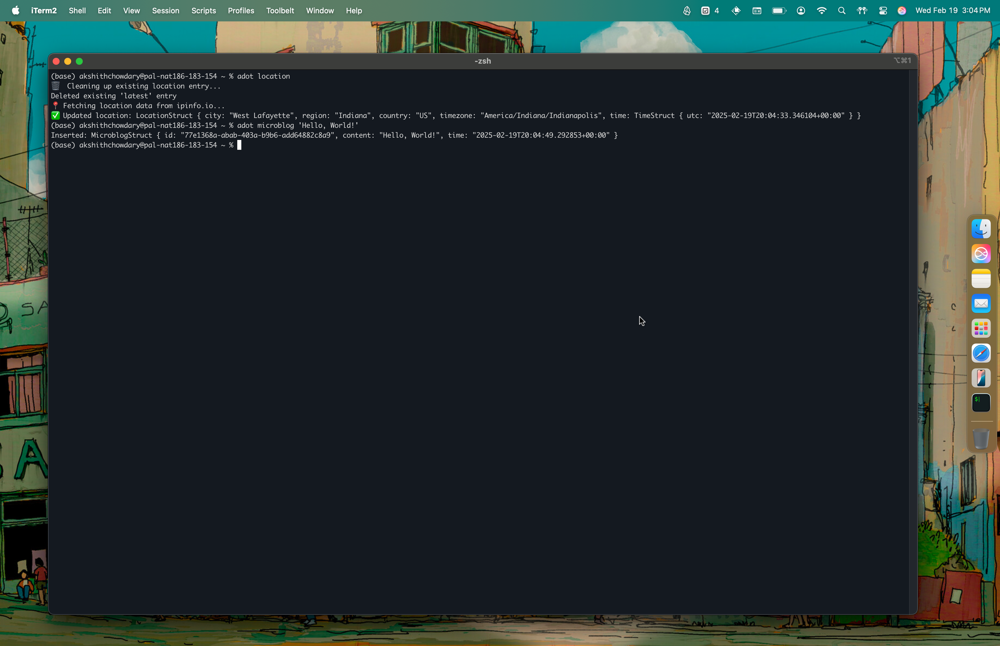

# adot

🔨: You can run it by simply cloning, running `cargo build --release` followed by `cargo install --path .`. Built in Rust.
***

`adot` is a simple supplementary tool I built for myself and my personal website in order to acquaint myself with Rust & CLI tooling. It contains a simple microblogging tool, a command to update my location that i display on my website and a `readme` command to add the footer at the bottom of my `README.md` files similar to the one in this file. I might add more commands to it if it so becomes necessary over the future.

In its current configuration, The path to the JSON file that contains the credentials for the firestore database, alongside the project name and a token to using `ipinfo` are hardcoded into my local `.zshrc` file, for the lack of a better solution. It uses the installed version of this project to find the `.png` files at its root necessary for the `readme` command.

 

&nbsp; like kdot but not. - akshithio - feb 2025 